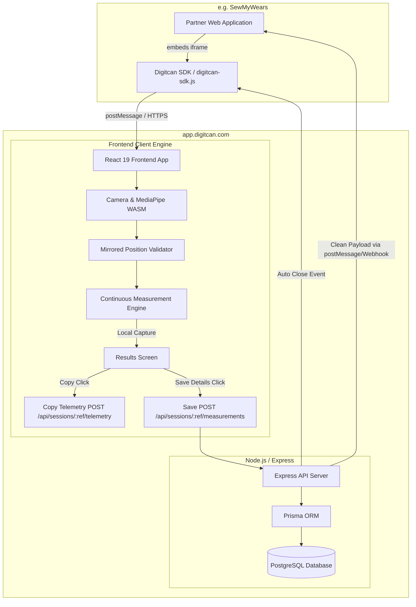

# LiveFittingRoom — Comprehensive System Documentation & Technical Guide

Welcome to the official technical documentation for **LiveFittingRoom** (Powered by Digitcan), a production-grade, SaaS body measurement service. LiveFittingRoom delivers fast, accurate, camera-based anthropometric measurements directly in the web browser using MediaPipe Pose tracking, real-time stability gating, live computer vision overlays, and a secure multi-tenant Node.js/Express backend.

---

## 📋 Table of Contents

1. [Executive Summary & Core Objectives](#1-executive-summary--core-objectives)
2. [Data Ownership & Privacy Architecture (3-Tier Separation)](#2-data-ownership--privacy-architecture-3-tier-separation)
3. [System Architecture & Flow](#3-system-architecture--flow)
4. [Repository Directory Structure](#4-repository-directory-structure)
5. [Database & Multi-Tenant Telemetry Data Model](#5-database--multi-tenant-telemetry-data-model)
6. [Backend API Surface](#6-backend-api-surface)
7. [Frontend State Machine & UI Components](#7-frontend-state-machine--ui-components)
8. [Controlled Copying & Copy Telemetry Logging](#8-controlled-copying--copy-telemetry-logging)
9. [Partner Integration & JavaScript SDK](#9-partner-integration--javascript-sdk)
10. [Production Deployment Guide (Render)](#10-production-deployment-guide-render)

---

## 1. Executive Summary & Core Objectives

**LiveFittingRoom** transforms body measurement into an instantaneous, frictionless experience. Users stand in front of any camera-enabled device, align themselves using visual feedback, and receive detailed body metrics within seconds—eliminating physical tape measures and manual button clicks.

### Key Capabilities & Architectural Principles:
* **Strict 3-Tier Data Separation**: Clean isolation between **Digitcan Internal Telemetry**, **Partner Integration Payload**, and **Customer UI**.
* **Clean Customer View**: Results screen displays strictly customer body measurements without technical metadata, internal session UUIDs, confidence scores, engine versions, or raw JSON downloads.
* **Controlled Copying & Copy Telemetry**: The **Copy Measurements** button copies clean measurement text to the clipboard while logging a `measurements_copied` event to Digitcan's internal operational telemetry.
* **Anti-Casual Copying & Screenshot Discouragement**: Text selection (`user-select: none`) and context menu events (`onContextMenu`) are disabled on customer-facing results elements.
* **Auto-Close Store Return**: Clicking **Save Details** persists data to Digitcan, triggers a brief `Details Saved Successfully` notification, delivers the clean payload to the partner website (e.g. **SewMyWears**), and automatically closes the fitting room overlay.

---

## 2. Data Ownership & Privacy Architecture (3-Tier Separation)

```
┌──────────────────────────────────────────────────────────┐
│                   Customer UI View                       │
│  • Only shows body measurements & unit (cm/in)          │
│  • Zero technical telemetry, confidence, or engine tags │
└────────────────────────────┬─────────────────────────────┘
                             │ (Save Details click)
┌────────────────────────────▼─────────────────────────────┐
│                 Client Integration Payload               │
│  • Pure measurement dictionary delivered to SewMyWears    │
│  • e.g. { "measurements": { "chest": 102 }, "unit": "cm"}│
└────────────────────────────┬─────────────────────────────┘
                             │ (HTTP POST /api/sessions/:ref/measurements)
┌────────────────────────────▼─────────────────────────────┐
│              Digitcan Internal Telemetry                 │
│  • Complete operational record stored in PostgreSQL       │
│  • Includes stability scores, frame counts, isSaved,    │
│    isCopied, copiedAt, processing duration & logs       │
└──────────────────────────────────────────────────────────┘
```

---

## 3. System Architecture & Flow



---

## 4. Repository Directory Structure

```
live-fitting-room/
├── render.yaml                  # Render production deployment spec
├── package.json                 # Monorepo build & script manager
├── index.html                   # HTML template with SVG favicon & iframe permissions
├── public/
│   └── sdk/
│       └── digitcan-sdk.js      # Embeddable Partner JavaScript SDK
├── src/
│   ├── App.tsx                  # Root app state machine
│   ├── index.css                # Custom CSS design system
│   ├── components/
│   │   ├── LandingScreen.tsx    # Hero onboarding with SVG body outline
│   │   ├── MeasurementScreen.tsx# Camera view & local auto-capture loop
│   │   └── ResultsScreen.tsx    # Clean customer results & Copy/Save controls
│   ├── hooks/
│   │   └── useMeasurementSession.ts # Session management & telemetry logger
│   └── fitting-room/
│       ├── useCamera.ts         # Camera acquisition hook
│       ├── useBodyTracking.ts   # MediaPipe PoseLandmarker & mirrored projection
│       ├── positionValidator.ts # Posture validation
│       ├── measurementEngine.ts # Stability gating & local result builder
│       └── measurementCanvasOverlay.ts # Mirrored real-time overlay
└── server/                      # Node.js Express Backend Service
    ├── prisma/
    │   └── schema.prisma        # PostgreSQL Multi-tenant schema with Telemetry
    └── src/
        ├── index.ts             # Express server setup
        └── routes/
            ├── sessions.ts      # Session endpoints
            └── measurements.ts  # Clean partner payload & internal telemetry routes
```

---

## 5. Database & Multi-Tenant Telemetry Data Model

Managed via **Prisma ORM** (`server/prisma/schema.prisma`):

```prisma
model Measurement {
  id                   String    @id @default(cuid())
  sessionId            String
  engineVersion        String    // e.g. "1.0.0"

  // Core body measurements in cm
  heightCm             Float?
  headCircumferenceCm  Float?
  neckCircumferenceCm  Float?
  shoulderWidthCm      Float?
  chestGirthCm         Float?
  waistGirthCm         Float?
  hipGirthCm           Float?
  torsoLengthCm        Float?
  sleeveLengthCm       Float?
  trouserLengthCm      Float?
  skirtLengthCm        Float?
  suggestedSize        String?

  // Quality / confidence metadata (Digitcan Internal)
  overallConfidence    Float?
  stabilityScore       Float?
  framesAnalyzed       Int?
  qualityGrade         String?

  // Operational Telemetry (Digitcan Internal)
  isSaved              Boolean   @default(false)
  isCopied             Boolean   @default(false)
  copiedAt             DateTime?
  startedAt            DateTime?
  processingDurationMs Int?
  retryCount           Int       @default(0)
  validationStatus     String?   @default("VALIDATED")

  capturedAt           DateTime  @default(now())
  session              Session   @relation(fields: [sessionId], references: [id])
}
```

---

## 6. Backend API Surface

| Method | Endpoint | Description | Visibility |
| :--- | :--- | :--- | :--- |
| `POST` | `/api/sessions` | Create a new session | Client / Internal |
| `POST` | `/api/sessions/:ref/measurements` | Save measurements & return clean partner payload | Client / Internal |
| `POST` | `/api/sessions/:ref/telemetry` | Log internal telemetry events (`measurements_copied`) | Digitcan Internal |
| `GET` | `/api/sessions/:ref/measurements` | Fetch clean partner payload for partner site | Client / Partner |

---

## 7. Partner Integration & JavaScript SDK

Partners (such as **SewMyWears**) integrate the SDK via `public/sdk/digitcan-sdk.js`:

```html
<script src="https://app.digitcan.com/sdk/digitcan-sdk.js"></script>
<script>
  const fr = new Digitcan.LiveFittingRoom({
    clientId: 'sewmywears',
    customerId: 'customer_82731',
    url: 'https://app.digitcan.com/fitting-room',
    onComplete: function(result) {
      // Receives clean partner payload: { measurements: { chest: 102, ... }, unit: 'cm' }
      console.log('Customer Measurements Saved:', result.measurements);
    }
  });

  document.getElementById('open-btn').addEventListener('click', function() {
    fr.open();
  });
</script>
```
